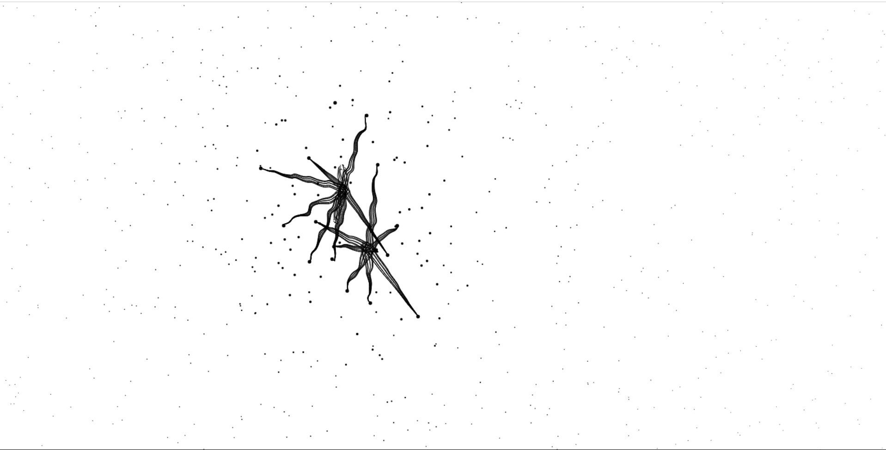

# PlaySphere
A repo for my small single page web apps projects

#### 1. Dark Mode 
##### project status: done
#### Overview

#### 2. Floating Input Label 
##### project status: done
#### Overview

#### 3. Morden Glassmorphism login Form 1
##### project status: inprogress

#### 4. Pure html and css Image Slider 1
##### project status: done
#### Overview

#### 5. Spider Effect HTML | CSS | JS
##### project status: done
#### Overview

#### 5. HTML | CSS | JS only Portfolio
##### project status: done
#### Overview
